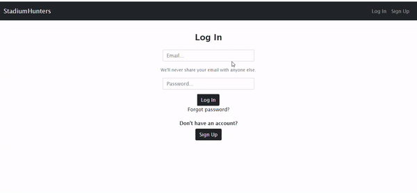
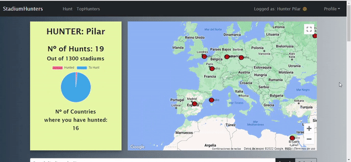
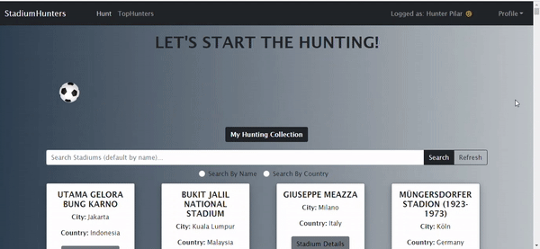
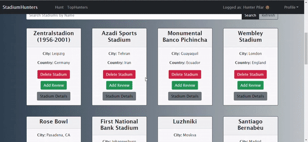
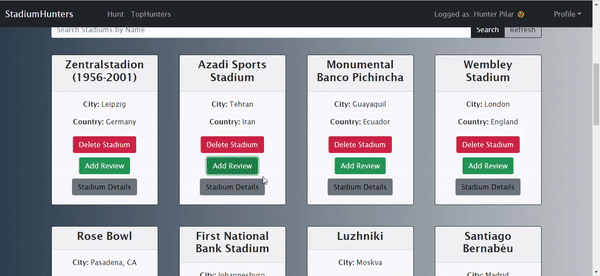
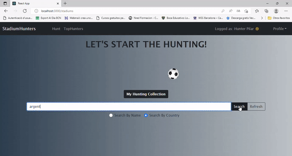

<!-- PROJECT LOGO -->
<br />
<div align="center">
  
   <h1 align="center">Stadium Hunter</h1>
 
</div>


## Table of Contents
* [General Info](#general-information)
* [Setup](#setup)
* [Technologies Used](#technologies-used)
* [Components and Pages Structure](#components-and-pages-structure)
* [Demo](#demo)
* [Project Status](#project-status)
* [Room for Improvement](#room-for-improvement)
* [Resources](#resources)


## General Information
This project is the frontend or client side of the Stadium Hunter Web application and it was made as the final project of a full stack development bootcamp.


## Setup

For development, you will only need Node.js installed on your environement. 

[Node](http://nodejs.org/) is really easy to install & now include [NPM](https://npmjs.org/).
You should be able to run the following command after the installation procedure
below.

    $ node --version
    v0.10.24

    $ npm --version
    1.3.21

#### Node installation on OS X

You will need to use a Terminal. On OS X, you can find the default terminal in
`/Applications/Utilities/Terminal.app`.

Please install [Homebrew](http://brew.sh/) if it's not already done with the following command.

    $ ruby -e "$(curl -fsSL https://raw.github.com/Homebrew/homebrew/go/install)"

If everything when fine, you should run

    brew install node

#### Node installation on Linux

    sudo apt-get install python-software-properties
    sudo add-apt-repository ppa:chris-lea/node.js
    sudo apt-get update
    sudo apt-get install nodejs

#### Node installation on Windows

Just go on [official Node.js website](http://nodejs.org/) & grab the installer.
Also, be sure to have `git` available in your PATH, `npm` might need it.


Clone the repo
   ```sh
   git clone https://github.com/Openbank-Java-Bootcamp/Pilar-Alvarez-Stadium-Hunter-Client
   ```
Install NPM packages
   ```sh
   npm install
   ```
Start
   ```sh
   $ npm start
   ```


## Technologies used


* [React.js](https://reactjs.org/)
* [Bootstrap](https://getbootstrap.com)


## Components and Pages Structure


## Demo

Login Page 



User Profile Page



"Hunt" a Stadium (Add it to your profile)



Add a Review to a Stadium



Delete a Stadium from your profile


See stadium details and reviews



Search a Stadium by Name or by Country




## Project Status
Project is: _no longer being worked on_.
This is a final project to a Full Stack Developer Bootcamp, although the idea of ​​the app motivates me, I consider the work finished with the purposes it was supposed to.


## Room for Improvement

- Let users add images to the review.
- Improve the styling.
- Integrate a chat so users can chat with other users.
- Add functionality to the map, in order to display the stadium info o filtrate stadiums in the list.


## Resources

Instructors of Ironhack: Raymond & Shaun.

https://www.baeldung.com/

https://stackoverflow.com/
